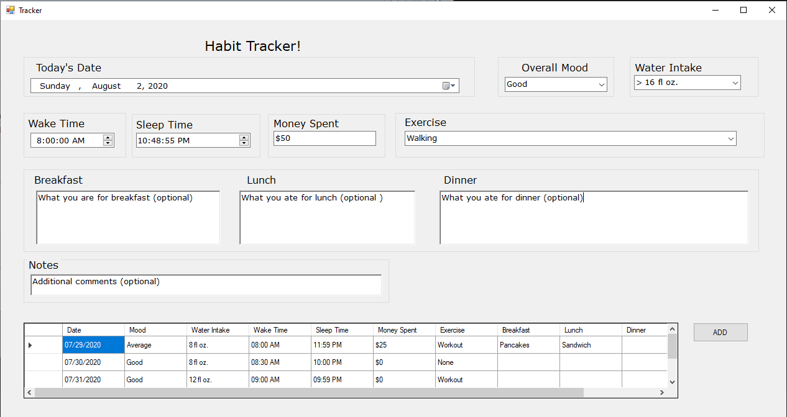

# Habit Tracker
This is an application to enter your daily habits such as when you woke up and how much money you spent.
All the data will be stored in an excel file which can be edited seperately.

## Description
There are 11 fields for the user to enter which are:
* Date
* Overall Mood
* Water Intake
* Wake Time
* Sleep Time
* Money Spent
* Exercise
* Breakfast (optional)
* Lunch (optional)
* Dinner (optional)
* Notes (optional)

Overall mood, water intake, and exercise have preselected choices or the user can enter whatever they want.
The data will be recorded in an excel file called habit_tracker.xlsx which the user can also manually edit.

When the user first loads the application, if the file exists, the data will be displayed in the bottom table. 
After adding the day's entry, the user can see the values in the table.
The user can add as many entries as desired.

## Dependencies/Technologies Used
* Visual Studio Studio Enterprise version: 16.5.30104.148
* Windows Forms App (.NET Framework)
* Microsoft Excel
* Windows 10
* C#

## How to run/use
1. Please have Visual Studio installed.
2. Download or clone the repository.
3. Open the Tracker.sln file in Visual Studio.
4. Set the build configuration to "Release" or "Debug".
5. Hit the "Start" button to run.
6. Enter the information and click the "Add" button to save the information to the habit_tracker excel file.
7. Enter as many times as desired.
8. The excel file will be located in WindowsFormApp1/bin/Debug if Debug was used or WindowsFormApp1/bin/Release if Release was used.

Suggestions: multiple excel files can be used such as seperating them by month by editing the Tracker.cs file excelFileName to the desired filename.

